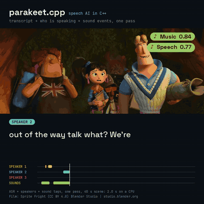
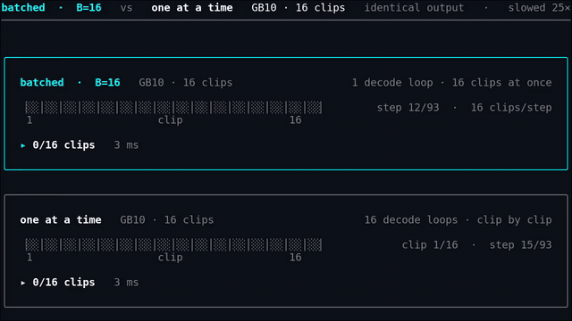
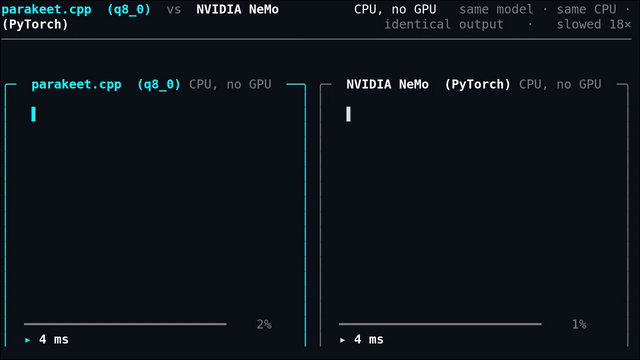

# parakeet.cpp

**Brought to you by the [LocalAI](https://github.com/mudler/LocalAI) team**, the folks behind LocalAI, the open-source AI engine that runs any model (LLMs, vision, voice, image, video) on any hardware, no GPU required.

[](https://huggingface.co/mudler/parakeet-cpp-gguf)
[](LICENSE)
[](https://github.com/mudler/LocalAI)

A C++17/[ggml](https://github.com/ggml-org/ggml) port of NVIDIA's [NeMo](https://github.com/NVIDIA-NeMo/NeMo) Parakeet speech recognition models, with voice activity detection, speaker diarization and identification, and sound-event tagging. It runs on CPU and on GPU backends, reads self-contained GGUF files, and needs no Python at inference time. Transcripts match NeMo (WER 0 on every published NeMo checkpoint).


> The same clip, side by side: identical output, parakeet.cpp finishes first (slowed down so a sub-100 ms race is watchable). More clips: [Demos](#demos).

**On this page:** [What is new](#what-is-new) | [Demos](#demos) | [Quick start](#quick-start) | [Models](#models) | [CLI cheat sheet](#cli-cheat-sheet) | [Server and Docker](#server-and-docker) | [C API](#c-api) | [Build](#build) | [Benchmarks](#benchmarks) | [Documentation](#documentation) | [Limits](#limits) | [Contributing](#contributing) | [License](#license-and-credits)

---

## What is new

Latest tagged release: **v0.5.0** (2026-08-01). Entries dated after it are on master, not in a release yet: build from source (see [Build](#build)) or use the `:latest` [Docker images](docs/docker.md).

- 🧬 **Speaker embeddings from the C API** (2026-10-05): `parakeet_capi_speaker_embed_pcm` returns the voice embedding of a clip, from a standalone encoder or a bundle `voice` component. [docs](docs/speaker.md)
- 🔏 **Speaker fingerprint** (2026-10-04): the speaker registry records which encoder made each voice print and refuses a model mismatch before naming. [docs](docs/diarization.md)
- 📦 **Bundle GGUF** (2026-10-04): ASR, VAD, diarization, sound events and speaker voice models in one file, with one licence per component; three bundles are published. [docs](docs/bundle.md)
- ✂️ **VAD-only files** (2026-10-04): 6 to 10 MB slices of the Ultra and Redux VAD head that run `vad` and cannot transcribe. [docs](docs/vad.md)
- 🗣️ **Standalone VAD** (2026-10-04): voice activity detection from the Ultra/Redux head or Silero, with a streaming API, and `transcribe --vad` to cut long audio at pauses. [docs](docs/vad.md)
- 🧮 **Exact batched decode** (2026-10-03): on CPU, batched transducer decode gives the same tokens as decoding each clip alone. [docs](docs/batching.md)
- 🧵 **Concurrent requests** (2026-10-03): an opt-in pool of CPU backends lets several requests run at once on one loaded model. [docs](docs/concurrency.md)
- 🪶 **Moondream Parakeet Ultra and Redux** (2026-10-03): Moondream's derivatives of parakeet-tdt-0.6b-v3, including a ternary Redux encoder with a packed CPU kernel in a 213 MB file. [docs](docs/ultra-redux.md)
- 🪪 **Speaker identification** (2026-09-30): enroll people from short clips and name the speakers in a diarized scene. [docs](docs/speaker.md)
- 🔔 **Sound events and the scene stream** (2026-09-29): CED tags 527 sound classes, and one time-ordered feed carries words, speakers and sounds. [docs](docs/sound.md)
- 👥 **Diarization** (2026-09-28): Nemotron-3-Diarization answers who spoke when, and speaker-attributed ASR says who said what. [docs](docs/diarization.md)
- 🌍 **Nemotron 3.5 streaming** (2026-06-06, in v0.5.0): multilingual (40+ locales), prompt-conditioned, offline and cache-aware streaming. [docs](docs/parity.md)
- 🍎 **Apple Metal** (2026-06-02, in v0.5.0): the encoder runs on Apple GPUs; CUDA and Vulkan are also supported (see [Build](#build)). [docs](benchmarks/BENCHMARK.md#apple-metal-m4)

The models are in [mudler/parakeet-cpp-gguf](https://huggingface.co/mudler/parakeet-cpp-gguf), and [LocalAI](https://localai.io) runs parakeet.cpp as its `parakeet-cpp` backend. The other docs are listed in the [Documentation](#documentation) table.

---

## Demos

Each clip is a short animated preview. The full video is linked below it. The clips below the first one were made for posts on X; the post links are not collected in this repository yet.

<table>
<tr>
<td width="50%" valign="top">

**Words, speakers and sounds in one pass**

[](benchmarks/media/scene_sprite_fright.mp4)

Excerpt of the scene demo: ASR, diarization and CED sound tags together, on CPU ([MP4 excerpt](benchmarks/media/scene_sprite_fright.mp4)). Film: Sprite Fright, CC BY 4.0, Blender Studio.

https://github.com/user-attachments/assets/02c29d27-ce26-46f2-8677-661c59686323

</td>
<td width="50%" valign="top">

**Batched decode: one loop, 16 clips**

[](benchmarks/media/batch_decode_race.mp4)

Serial against batched decode of 16 clips, with identical output ([MP4](benchmarks/media/batch_decode_race.mp4)). Details: [batching.md](docs/batching.md).


</td>
</tr>
<tr>
<td width="50%" valign="top">

**Nemotron 3.5 streaming against NeMo, on CPU**

[](benchmarks/media/nemotron_streaming_race.mp4)

Same model, same CPU, identical output ([MP4](benchmarks/media/nemotron_streaming_race.mp4)).

</td>
<td width="50%" valign="top">

**More benchmarks**

- [parakeet.cpp against NeMo on CPU](benchmarks/media/cpu_nemo_duel.mp4) (about 1.5x faster, same output)
- [against whisper.cpp turbo on GPU](benchmarks/media/gpu_whisper_duel.mp4) (about 12x faster)
- [against whisper.cpp turbo on CPU](benchmarks/media/cpu_duel.mp4) (about 27x faster)

These are single-clip demos, not benchmarks. See [Benchmarks](#benchmarks).

</td>
</tr>
</table>

---

## Quick start

Get the CLI from a [release](https://github.com/mudler/parakeet.cpp/releases) (see [Build](#build) to compile it yourself; the VAD and bundle commands below need a build from `master`). Then download a model. Everything is in [mudler/parakeet-cpp-gguf](https://huggingface.co/mudler/parakeet-cpp-gguf):

```sh
HF=https://huggingface.co/mudler/parakeet-cpp-gguf/resolve/main
curl -LO $HF/tdt_ctc-110m-q8_0.gguf     # 178 MB, English, hybrid TDT+CTC
```

**Transcribe.** `tests/fixtures/speech.wav` is in this repository:

```sh
parakeet-cli transcribe --model tdt_ctc-110m-q8_0.gguf --input tests/fixtures/speech.wav
# Well, I don't wish to see it any more, observed Phoebe, turning away her eyes. It is certainly very like the old portrait.

parakeet-cli transcribe --model tdt_ctc-110m-q8_0.gguf --input tests/fixtures/speech.wav --timestamps
# 0.48-0.64  Well,  (0.79)
# 0.80-0.88  I  (1.00)
# ...
```

**Find speech with VAD.** Silero is a 1.3 MB file:

```sh
curl -LO $HF/silero-vad-f16.gguf
parakeet-cli vad --model silero-vad-f16.gguf --input tests/fixtures/two_speakers.wav
# {"mode":"speech","duration":23.605,"frame_sec":0.032,"backend":"cpu","segments":[{"start":0.514,"end":5.534}, ...]}

# Cut long audio at pauses with Silero, then transcribe each piece with any ASR model
parakeet-cli transcribe --model tdt_ctc-110m-q8_0.gguf --input long.wav --vad --vad-model silero-vad-f16.gguf
```

**Use a bundle.** One 338 MB file holds the 110M ASR model, Silero, diarization, CED sound tagging and a speaker encoder:

```sh
curl -LO $HF/parakeet-bundle-small.gguf
parakeet-cli info parakeet-bundle-small.gguf          # components, licences, sizes
parakeet-cli transcribe --model parakeet-bundle-small.gguf --input tests/fixtures/speech.wav --vad
parakeet-cli scene --model parakeet-bundle-small.gguf --diar parakeet-bundle-small.gguf \
  --sound parakeet-bundle-small.gguf --input tests/fixtures/two_speakers.wav
# [00:00.4 - 00:05.4]  Speaker 0: mister Quilter is the apostle of the middle classes, and we are glad to welcome his gospel.
# [00:06.8 - 00:10.8]  Speaker 1: Well, I don't wish to see it any more, observed Phoebe, turning away her eyes.
# ...
```

The published bundles are `parakeet-bundle-small` (110M ASR, 338 MB), `parakeet-bundle-standard` (0.6B v3 ASR, 1.1 GB) and `parakeet-bundle-moondream-redux` (packed Redux plus Silero, 215 MB). Each has a `NOTICE-*.txt` file with the credits and licences. See [bundle.md](docs/bundle.md).

To use it from a program, see [C API](#c-api). To serve it over HTTP, see [Server and Docker](#server-and-docker).

---

## Models

All models below are published as GGUF in [mudler/parakeet-cpp-gguf](https://huggingface.co/mudler/parakeet-cpp-gguf) (f16, q8_0, q6_k, q5_k and q4_k for the ASR models). The NVIDIA models are validated at WER 0 against NeMo. Per-model parity: [parity.md](docs/parity.md). Licences per model: [licenses.md](docs/licenses.md).

| Model | Type | Size | Notes |
| ----- | ---- | ---- | ----- |
| [parakeet-tdt_ctc-110m](https://huggingface.co/nvidia/parakeet-tdt_ctc-110m) | hybrid TDT+CTC | 110M | English, the small anchor checkpoint |
| [parakeet-ctc-0.6b](https://huggingface.co/nvidia/parakeet-ctc-0.6b), [parakeet-ctc-1.1b](https://huggingface.co/nvidia/parakeet-ctc-1.1b) | CTC | 0.6B, 1.1B | English |
| [parakeet-rnnt-0.6b](https://huggingface.co/nvidia/parakeet-rnnt-0.6b), [parakeet-rnnt-1.1b](https://huggingface.co/nvidia/parakeet-rnnt-1.1b) | RNNT | 0.6B, 1.1B | English |
| [parakeet-tdt-0.6b-v2](https://huggingface.co/nvidia/parakeet-tdt-0.6b-v2), [parakeet-tdt-1.1b](https://huggingface.co/nvidia/parakeet-tdt-1.1b) | TDT | 0.6B, 1.1B | English |
| [parakeet-tdt-0.6b-v3](https://huggingface.co/nvidia/parakeet-tdt-0.6b-v3) | TDT | 0.6B | 25 European languages |
| [parakeet-tdt_ctc-1.1b](https://huggingface.co/nvidia/parakeet-tdt_ctc-1.1b) | hybrid TDT+CTC | 1.1B | English |
| [parakeet_realtime_eou_120m-v1](https://huggingface.co/nvidia/parakeet_realtime_eou_120m-v1) | RNNT, streaming | 120M | Cache-aware streaming with end-of-utterance events (`--stream`) |
| [nemotron-3.5-asr-streaming-0.6b](https://huggingface.co/nvidia/nemotron-3.5-asr-streaming-0.6b) | RNNT, streaming | 0.6B | 40+ locales, language set with `--lang` (default `auto`), offline and streaming. OpenMDW-1.1 |
| [Nemotron-3-Diarization](https://huggingface.co/nvidia/Nemotron-3-Diarization) | Sortformer | n/a | Who spoke when, up to 8 speakers. See [diarization.md](docs/diarization.md) |
| [parakeet-ultra](https://huggingface.co/moondream/parakeet-ultra) | TDT + VAD head | 0.6B | Moondream, from parakeet-tdt-0.6b-v3. CC-BY-4.0. Not NeMo-validated |
| [parakeet-redux](https://huggingface.co/moondream/parakeet-redux) | TDT + VAD head | 0.6B | Moondream, ternary encoder. CPU only, offline only. CC-BY-4.0. Not NeMo-validated |
| [Silero VAD](https://github.com/snakers4/silero-vad) | VAD | 1.3 MB | MIT. 16 kHz and 8 kHz |
| [CED](https://huggingface.co/mudler/ced-gguf) | sound events | 6 to 88 MB | 527 classes, from [ced.cpp](https://github.com/localai-org/ced.cpp). See [sound.md](docs/sound.md) |

Convert your own checkpoint with `scripts/convert_parakeet_to_gguf.py` (see [conversion.md](docs/conversion.md)) and quantize with `parakeet-cli quantize` (see [quantization.md](docs/quantization.md)).

---

## CLI cheat sheet

The binary is `build/examples/cli/parakeet-cli`. The full list of examples and options is in [cli.md](docs/cli.md).

```sh
parakeet-cli info <model.gguf> [--component NAME]               # metadata; for a bundle, the component list
parakeet-cli transcribe --model M --input A.wav                 # default decoder; "--input -" reads WAV from stdin
parakeet-cli transcribe ... --decoder ctc|tdt                   # force a decoder
parakeet-cli transcribe ... --timestamps | --json               # per-word times and confidence
parakeet-cli transcribe ... --beam-size 4 --nbest 4             # TDT N-best, see docs/tdt-nbest.md
parakeet-cli transcribe ... --stream                            # cache-aware streaming (EOU and Nemotron models)
parakeet-cli transcribe ... --lang <locale>                     # Nemotron 3.5 language, default auto
parakeet-cli transcribe ... --vad [--vad-model silero.gguf]     # cut long audio at pauses (offline, greedy only)
parakeet-cli transcribe ... --vad-trim SEC                      # trim each piece to its speech plus SEC (default 0.3, 0 = whole cuts)
parakeet-cli transcribe ... --min-local-conf 0.5                # opt-in: drop words invented on noise (docs/vad.md)
parakeet-cli vad --model M --input A.wav [--mode segments] [--probabilities]   # speech regions as JSON
parakeet-cli scene --model ASR --diar DIAR --sound CED --input A.wav            # words + speakers + sounds
parakeet-cli scene ... --speakers SPK.gguf --registry R         # name the speakers
parakeet-cli enroll --model SPK.gguf --name Ada --input ada.wav --registry R
parakeet-cli quantize <in.gguf> <out.gguf> <q4_0|q5_0|q8_0|q4_k|q5_k|q6_k>
parakeet-cli bench --model M --manifest F [--concurrency K]     # throughput
parakeet-cli bench-decode ... | bench-batch ...                 # batched decode, see docs/batching.md
```

Device selection is automatic: the CLI uses the first GPU the ggml registry reports. Set `PARAKEET_DEVICE=cpu` to force CPU, or a device name such as `CUDA0` or `Vulkan1`. Ops that a backend lacks run on the CPU.

---

## Server and Docker

`parakeet-server` is a small OpenAI-compatible HTTP server (`POST /v1/audio/transcriptions`). It serves one model, one request at a time, WAV uploads only, so treat it as an example. For production use [LocalAI](https://localai.io), which embeds parakeet.cpp as a backend and adds a gallery, concurrency, multi-model serving, auth and metrics. See [examples/server/README.md](examples/server/README.md).

```sh
parakeet-server --model tdt_ctc-110m --port 8080
curl -F file=@audio.wav -F response_format=verbose_json http://localhost:8080/v1/audio/transcriptions
```

Images for the CLI and the server are published to GHCR on every push to `master` (CPU and CUDA, `linux/amd64` and `linux/arm64`): `ghcr.io/mudler/parakeet.cpp-cli` and `ghcr.io/mudler/parakeet.cpp-server`. See [docker.md](docs/docker.md).

---

## C API

`include/parakeet_capi.h` is a flat, exception-free C API for `dlopen`, FFI and LocalAI. Build the shared library with `-DPARAKEET_SHARED=ON` (see [Build](#build)).

```c
#include "parakeet_capi.h"

parakeet_ctx *ctx = parakeet_capi_load("model.gguf");   // load once, reuse
if (!ctx) { fprintf(stderr, "%s\n", parakeet_capi_last_error(ctx)); return 1; }

char *text = parakeet_capi_transcribe_path(ctx, "audio.wav", 0 /*default decoder*/);
if (text) { printf("%s\n", text); parakeet_capi_free_string(text); }
parakeet_capi_free(ctx);
```

- **Surface:** offline and streaming transcription (text or JSON with word and token timestamps), batched transcription, VAD (offline and streaming), diarization, speaker-attributed ASR, sound events, the scene stream, speaker identification, bundle loading and the concurrency pool.
- **ABI:** the current version is **10** (`parakeet_capi_abi_version()`). Later additions (VAD, bundle, encoder fingerprint, concurrency) are additive and keep ABI 10. LocalAI depends on the offline and streaming transcription symbols, so do not change their signatures without a coordinated bump.
- More examples and the JSON shapes: [capi.md](docs/capi.md). Exact signatures: `include/parakeet_capi.h`.

---

## Build

```sh
git clone --recursive https://github.com/mudler/parakeet.cpp
cd parakeet.cpp
cmake -B build && cmake --build build -j
# CLI: build/examples/cli/parakeet-cli
```

Use `-DGGML_NATIVE=OFF` for a portable binary. For the shared library: `cmake -B build-shared -DPARAKEET_SHARED=ON && cmake --build build-shared -j`, which produces `libparakeet.so`.

| GPU backend | CMake flag | Status |
| ----------- | ---------- | ------ |
| CUDA | `-DPARAKEET_GGML_CUDA=ON` | Release binaries for Turing (sm_75) and newer. Benchmarked on a GB10. |
| Metal | `-DPARAKEET_GGML_METAL=ON` | Release binary for macOS arm64. Benchmarked on an M4. |
| Vulkan | `-DPARAKEET_GGML_VULKAN=ON` | Release binaries for Linux and Windows. Needs the Vulkan loader. |
| ROCm (HIP) | `-DPARAKEET_GGML_HIP=ON` | Forwarded to ggml. Not tested by us. |

GPU backends are not exercised in CI. Other options:

| Option | Default | Purpose |
| ------ | ------- | ------- |
| `PARAKEET_BUILD_TESTS` | OFF | ctest targets |
| `PARAKEET_BUILD_CLI` | ON | `parakeet-cli` |
| `PARAKEET_BUILD_SERVER` | ON | `parakeet-server` |
| `PARAKEET_SHARED` | OFF | `libparakeet` as a shared library |
| `PARAKEET_WITH_CED` | ON | Sound-event tagging (ced.cpp) |
| `PARAKEET_WITH_VOICEDETECT` | ON | Speaker identification (voice-detect.cpp) |

**Pre-built binaries.** Each [release](https://github.com/mudler/parakeet.cpp/releases) ships `parakeet-cli` bundles: Linux x64 (cpu, vulkan, cuda), Linux arm64 (cpu, vulkan), macOS arm64 (metal), macOS x64 (cpu), Windows x64 (cpu, vulkan, cuda), plus AppImages and library tarballs. On Windows with CUDA, also download `cudart-parakeet-bin-win-cuda-x64.zip` unless the CUDA toolkit is installed. The newest release (v0.5.0) does not include the features marked **master** above.

---

## Benchmarks

Speed is audio seconds over processing seconds (RTFx), against NeMo's PyTorch runtime on the same machine, batch size 1. Higher is faster. Numbers come from [benchmarks/BENCHMARK.md](benchmarks/BENCHMARK.md): CPU runs use 8 threads on a 20-core x86 host, GPU runs use one NVIDIA GB10. These were shared development machines, not quiet lab hosts, so read the method before you quote a number.

| Measurement | Result | Source |
| ----------- | ------ | ------ |
| CPU, f32, 10 models, LibriSpeech test-clean | 1.11x to 1.69x faster than NeMo (mean 1.40x), same transcripts | BENCHMARK.md, Headline |
| CPU, q8_0 | mean 1.56x, up to 1.89x, 37% of the f32 size | BENCHMARK.md, Quantization |
| GPU (GB10), f32 | median 1.25x, up to 4.3x (`tdt_ctc-110m`) | [performance.md](docs/performance.md) |
| Nemotron 3.5, one 7.4 s clip, CPU | 2.40x at f32, 2.52x at q8_0 | BENCHMARK.md, Nemotron |
| Batched decode, batch 16 | about 10x to 12x on the GB10 (f16), about 3x to 5x on CPU (q5_k) | BENCHMARK.md, Batched decode |
| Apple M4, Metal against CPU | 1.3x to 5.6x, most on the 0.6B and 1.1B models | BENCHMARK.md, Apple Metal |
| Redux (packed ternary) against the same model in F16, CPU | median RTF 75.6 against 46.1 per utterance (8 threads, AVX-512 VNNI); 6.8x smaller file; WER 1.96% on 100 LibriSpeech utterances | [ternary.md](docs/ternary.md) |
| Peak RAM against NeMo | about 2x lower at f32 (for example 2582 MB against 5598 MB on `tdt-0.6b-v3`) | BENCHMARK.md, Headline |

VAD accuracy, speed and size, Silero against the Parakeet head against whisper.cpp, with the scripts to repeat them: [vad-benchmarks.md](docs/vad-benchmarks.md). Some of those runs were not on a quiet machine, and the page says which. Transcript parity with NeMo, stage by stage: [parity.md](docs/parity.md). Concurrency throughput (it can go up or down depending on model size and cores): [concurrency.md](docs/concurrency.md).

<p align="center">
  <a href="benchmarks/BENCHMARK.md"></a>
  <a href="benchmarks/BENCHMARK.md"></a>
</p>

---

## Documentation

| Page | What it covers |
| ---- | -------------- |
| [cli.md](docs/cli.md) | Full CLI examples, the server, quantize |
| [capi.md](docs/capi.md) | C API examples, JSON shapes, streaming |
| [vad.md](docs/vad.md) | The two detectors, options, which one to use, VAD-only files |
| [vad-benchmarks.md](docs/vad-benchmarks.md) | Every VAD measurement and how to repeat it |
| [ultra-redux.md](docs/ultra-redux.md) | The Moondream models: files, credits, dequantized Redux |
| [ternary.md](docs/ternary.md) | Packed ternary format, kernels, limits, speed |
| [bundle.md](docs/bundle.md) | Bundle GGUF format, selection rules, licences, build and verify |
| [diarization.md](docs/diarization.md) | Diarization, speaker-attributed ASR, encoder fingerprint, speed |
| [sound.md](docs/sound.md) | Sound events (CED) and the scene stream |
| [speaker.md](docs/speaker.md) | Enroll and name speakers, C API v9 and v10, speaker embeddings, what is not measured |
| [batching.md](docs/batching.md) | Batched decode, exactness, how to measure |
| [concurrency.md](docs/concurrency.md) | Backend pool, thread rules, measured throughput |
| [tdt-nbest.md](docs/tdt-nbest.md) | TDT beam search and N-best output |
| [parity.md](docs/parity.md) | Coverage matrix and numerical parity against NeMo |
| [performance.md](docs/performance.md) | Headline speed numbers and where they come from |
| [quantization.md](docs/quantization.md) | Which weights are quantized, size and WER per type |
| [conversion.md](docs/conversion.md) | GGUF schema, Python setup, converting a model |
| [docker.md](docs/docker.md) | Docker images |
| [licenses.md](docs/licenses.md) | Licence of every published model |
| [benchmarks/BENCHMARK.md](benchmarks/BENCHMARK.md) | Full CPU and GPU benchmark, plots, methodology |
| [AGENTS.md](AGENTS.md) | Repository layout, test list, rules for contributors and agents |

---

## Limits

- **Redux** runs on CPU only and offline only. SIMD kernels exist for x86-64 (AVX2, AVX-512 VNNI) and aarch64 with dotprod; other targets use a slow scalar kernel. See [ternary.md](docs/ternary.md).
- **Ultra and Redux** are not NeMo-validated. Their parity is transcript-level against our own v3 path.
- **The VAD head** in Ultra and Redux gives false alarms on audio without speech. Use Silero as an always-on gate. See [vad.md](docs/vad.md).
- **`transcribe --vad`** is offline and greedy decoding only. VAD-only files cannot transcribe.
- **Bundles:** `bench` and the streaming ASR modes do not take a bundle. No bundle was run on a GPU. See [bundle.md](docs/bundle.md).
- **Speaker identification** was measured on one two-voice fixture. See [speaker.md](docs/speaker.md).
- **Batching** does not apply to standalone CTC models. On CPU the batched decode step is bit-identical to single-clip decode; on GPU it agrees to about 1e-4, and the batched encoder is close to, not equal to, the single-clip one.
- **Concurrency** uses CPU backends only, can be slower than one backend on large models, and uses more memory per backend.
- **`parakeet-server`** serves one model, one request at a time, WAV only.
- **GPU:** CUDA, Metal and Vulkan are supported; ROCm is untested. GPU backends are not exercised in CI.
- **Open work:** the GPU encoder kernels. ggml's generic CUDA conv and attention kernels still trail NeMo's tuned cuDNN, so the gain is smallest on the CTC models (about 1.2x).

---

## Contributing

Issues and pull requests are welcome. Read [AGENTS.md](AGENTS.md) first: it has the repository layout, the performance invariants that must not regress, and the policy for AI-assisted contributions (an `Assisted-by:` trailer, no `Co-Authored-By` for AI).

```sh
cmake -B build -DPARAKEET_BUILD_TESTS=ON && cmake --build build -j
ctest --test-dir build --output-on-failure -LE model     # no model files needed
```

Tests labelled `model` need a converted checkpoint (set `PARAKEET_TEST_GGUF` and the other variables listed in AGENTS.md) and skip with exit code 77 when it is missing.

**Community projects** (not maintained by the core team): [parakeet-ios-demo](https://github.com/Kashif-E/parakeet-ios-demo), live on-device streaming speech-to-text on iOS (SwiftUI) over the streaming C API, by [@Kashif-E](https://github.com/Kashif-E).

---

## License and credits

parakeet.cpp is released under the [MIT License](LICENSE). The model weights keep the licences of the original models, so check each model card. Most NVIDIA Parakeet models are CC-BY-4.0. `nemotron-3.5-asr-streaming` and Nemotron-3-Diarization are OpenMDW-1.1, `parakeet_realtime_eou_120m-v1` is under the NVIDIA Open Model License, and the Silero VAD files are MIT. Moondream's [parakeet-ultra](https://huggingface.co/moondream/parakeet-ultra) and [parakeet-redux](https://huggingface.co/moondream/parakeet-redux) are CC-BY-4.0: credit Moondream and NVIDIA ([parakeet-tdt-0.6b-v3](https://huggingface.co/nvidia/parakeet-tdt-0.6b-v3)), link the [license](https://creativecommons.org/licenses/by/4.0/), and note that GGUF files made here are converted (and quantized, or dequantized for Redux) copies, not retrained models. The full table is in [docs/licenses.md](docs/licenses.md). A bundle keeps one licence per component (see [bundle.md](docs/bundle.md)).

The Parakeet models are by NVIDIA NeMo ([NVIDIA-NeMo/NeMo](https://github.com/NVIDIA-NeMo/NeMo)). Parakeet Ultra and Redux are by [Moondream](https://huggingface.co/moondream), derived from NVIDIA's parakeet-tdt-0.6b-v3. Sound tagging uses [CED](https://github.com/RicherMans/CED) by Heinrich Dinkel and colleagues at Xiaomi. The demo film is Sprite Fright, CC BY 4.0, Blender Studio.

If you use parakeet.cpp, please cite this repository and the original models:

```bibtex
@software{parakeet_cpp,
  title  = {parakeet.cpp: a C++/ggml inference engine for NVIDIA Parakeet ASR},
  author = {Di Giacinto, Ettore and Palethorpe, Richard},
  url    = {https://github.com/mudler/parakeet.cpp},
  year   = {2026}
}
```

Author: Ettore Di Giacinto ([@mudler](https://github.com/mudler)).

---

Built by the [LocalAI](https://github.com/mudler/LocalAI) team. If you want to run speech recognition (and LLMs, vision, voice, image, and video models) locally on any hardware with an OpenAI-compatible API, [give LocalAI a star](https://github.com/mudler/LocalAI).
