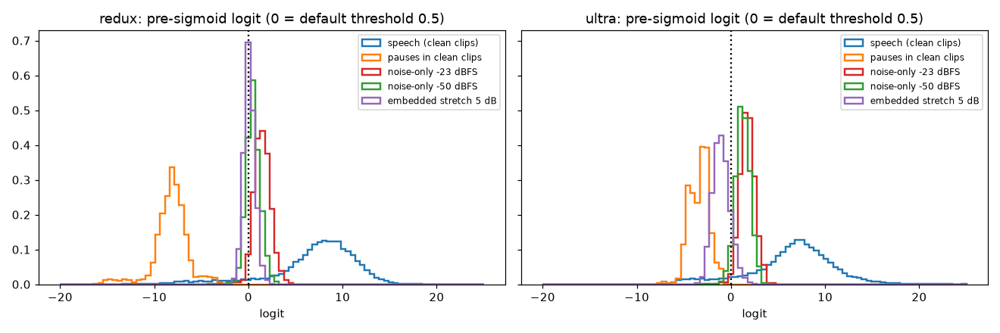
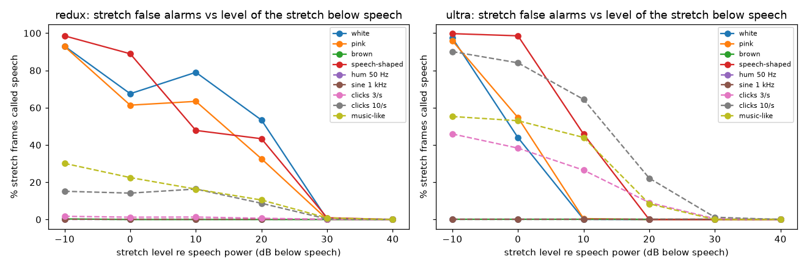

# VAD benchmarks

This page lists every voice activity detection (VAD) measurement made for
parakeet.cpp so far: how each one was built, what it measures, the numbers, and
how to run it again. For the API and the model files, see [vad.md](vad.md).

Read the caveats before you quote a number. Every reference here is coarse, the
machine was shared, and some runs were not on a quiet machine. A difference that
is smaller than the noise is not claimed.

The detectors:

| Name | What it is |
| --- | --- |
| Silero | Silero VAD 6.2.3 (MIT), 32 ms frames, from its own small GGUF (F32 or F16) |
| Ultra Q8_0 | VAD head of `moondream/parakeet-ultra`, GGUF in Q8_0, 80 ms frames |
| Redux packed | VAD head of `moondream/parakeet-redux`, packed ternary GGUF, 80 ms frames |
| whisper.cpp Silero | Silero VAD inside whisper.cpp (`whisper_vad_*`), used as a comparison |
| ONNX Silero | The official Silero ONNX file run with onnxruntime (CPU, one thread), used as the reference |

## Summary

Accuracy is the frame level F1 (percent) against a coarse reference, see
[Metrics](#metrics). Speed is audio seconds per wall second ("x real time") on a
300 s clip. Higher is faster.

| Detector | F1, clean synthetic | F1, pink noise 0 dB | F1, TED-LIUM talks | Speed | Peak memory | File size |
| --- | ---: | ---: | ---: | ---: | ---: | ---: |
| Silero (matched settings) | 94.1 | 91.7 | 91.8 | about 660x on 1 thread, `parakeet-cli vad`, includes process start and model load | 60 MB (`parakeet-cli vad`, F32 and F16) | 2.2 MB (F32), 1.3 MB (F16) |
| Silero (its own defaults) | 94.4 | 91.9 | 92.1 | not timed separately | same as above | same as above |
| Ultra Q8_0 head, full ASR GGUF | 95.0 | 93.4 | 93.8 | 216x, 8 threads (older run); 91.6x on 1 thread and 266.6x on 8 threads in the slice run, busy machine | 905 MiB loaded, 1134 MiB after a 33 s clip | 941.5 MB |
| Ultra Q8_0 head, slice file (PR 87, not in a release yet) | same as the full file (see below) | same | same | 91.8x on 1 thread, 257.8x on 8 threads, busy machine | 12 MiB loaded, 241 MiB after a 33 s clip | 6.0 MB |
| Redux packed head, full ASR GGUF | 95.4 | 94.3 | 94.2 | 221x, 8 threads (older run); 94.9x on 1 thread and 267.1x on 8 threads in the slice run, busy machine | 372 MiB loaded, 603 MiB after a 33 s clip | 213.3 MB |
| Redux packed head, slice file (PR 87, not in a release yet) | same as the full file | same | same | 95.1x on 1 thread, 266.7x on 8 threads, busy machine | 16 MiB loaded, 246 MiB after a 33 s clip | 9.9 MB |
| Silero F16, same build as the slice run | see Silero rows | | | 736x on 1 thread, 485x on 8 threads, busy machine | 9 MiB loaded, 13 MiB after a 33 s clip | 1.3 MB |
| whisper.cpp Silero | 94.1 | not run | not run | in process: 686x on 1 thread | 36 MB (test harness) | 0.9 MB |
| ONNX Silero (onnxruntime) | 94.0 | not run | not run | in process: 449x on 1 thread, Python loop | 104 MB | 2.3 MB |

How to read it:

- The synthetic and TED columns come from the
  [heads against Silero](#parakeet-heads-against-silero) benchmark. The whisper.cpp
  and ONNX rows come from the [Silero parity](#silero-in-whispercpp-and-in-parakeetcpp)
  benchmark, which uses a different synthetic corpus (120 clips, 3 conditions). The
  clean F1 of "Silero" and "whisper.cpp Silero" are therefore not from the same clips.
  Compare rows only inside one benchmark.
- "Matched settings" means Silero ran with the same segmentation settings as the
  heads (threshold 0.5, minimum speech 100 ms, minimum silence 200 ms, no padding).
  See [Metrics](#metrics).
- Head speeds on 8 threads come from two separate runs on a busy machine (see the
  caveats of each section): the older run (216x to 222x for four head builds, a Python
  wrapper, load average about 6) and the slice run (255x to 268x, one build of the
  C++ harness, load average up to 17 at the start of some rounds). They differ by about
  20%, which is the size of the noise on this machine for 8 threads, not a
  difference between methods. The 1 thread rounds of the slice run were within about 5% of each other,
  except for two outlier rounds (69.8x and 84.7x).
- The speed columns of Silero and the heads are not a like for like comparison of the
  models. They show the cost of using each one as a stand alone gate.
- The heads need the ASR GGUF unless you use a slice file. A slice is a GGUF with only
  the head path, made by `scripts/slice_vad_gguf.py` (PR 87, in master, not in a tagged release yet).
  Its VAD output is
  byte for byte the same as the parent file on three clips, so the accuracy columns
  apply to the slice unchanged. See [Slice only head](#slice-only-head). The published
  slices are listed in [vad.md](vad.md#published-slices).
- All memory and load numbers for the heads are in the slice section.

### Machine and build

| Item | Value |
| --- | --- |
| CPU | AMD Ryzen 9 class (Zen 5), 16-core desktop part; the OS shows 20 logical CPUs, one thread per core |
| Memory | 84 GB |
| OS and compiler | Linux 6.8, GCC 13.3, CMake 3.28 |
| ggml | commit e705c5fe (the submodule of this repository), `GGML_NATIVE=ON`, Release |
| parakeet.cpp | the VAD code of PR 83 (merged as `6165e3d`); see the per benchmark build notes below |
| whisper.cpp | commit `60c0be6ac8fa71b1a2ae2dd938a31a34a508e774` (version 1.9.4), CPU only |
| Load | the machine was shared with other jobs; load is given per benchmark |

Build commits per benchmark:

| Benchmark | parakeet.cpp build |
| --- | --- |
| Heads against Silero | a development build of the VAD branch; the commit was not recorded (unverified) |
| Silero in whisper.cpp and in parakeet.cpp | `c1a8391102d34074f48e758c441758327d2465b7`, the VAD branch before its squash into `6165e3d` |
| Long talks, batched decode | three builds, called base, b0 and b1: master before PR 81, PR 81 (`cbabaf5`), PR 82 (`9fdf3a1`). The result files do not record the commits; the mapping is from the PR 82 description (unverified) |
| Timing re-run | `6165e3d`, see [Timing re-run](#timing-re-run) |

## Metrics

All VAD output is reduced to speech regions (start and end in seconds).

- **Frame level precision, recall, F1.** The regions of the detector and of the
  reference are turned into a speech mask on a 10 ms grid. Counts of true positive,
  false positive, false negative and true negative frames are summed over all clips
  of a group, then precision, recall and F1 are computed from the sums. Pooled, not
  an average of per clip scores.
- **Boundary error.** For each reference start (and end), the distance in ms to the
  nearest detected start (end). Reported as median and 90th percentile, in ms, plus
  the miss rate: the share of reference boundaries with no detected boundary within
  1 s. "All conditions" pools start and end errors.
- **Agreement.** Two detectors compared with each other: F1 of the two speech masks,
  Cohen's kappa, and IoU (intersection over union) of the masks.
- **Probability parity.** Per frame, the absolute difference of the speech
  probability against onnxruntime on the official ONNX file. Also the share of
  frames where the decision at 0.5 flips.
- **Matched settings.** The segmentation step is not the same code in every system,
  and the defaults differ. For a fair model comparison, Silero in the first
  benchmark runs the `silero-vad` package (`get_speech_timestamps`) with threshold
  0.5, `min_speech_duration_ms` 100, `min_silence_duration_ms` 200,
  `speech_pad_ms` 0. These are the head defaults. Silero's reference code also
  lowers the threshold by 0.15 once speech has started (hysteresis); the parakeet.cpp
  segmenter has no hysteresis (see [vad.md](vad.md)). "Silero (its own defaults)" uses
  the package defaults (minimum speech 250 ms, minimum silence 100 ms, padding 30 ms).
  The heads ran with their own defaults, which are the matched values.

## Parakeet heads against Silero

### Data

Synthetic clips. Built from LibriSpeech test-clean (public). Every clip has five
utterances in a random order. Each utterance is trimmed at the first and last 10 ms
frame whose RMS is above 1% of the peak frame RMS. The utterances are joined with
gaps of 0.3 to 2.0 s (uniform), with 0.5 to 1.5 s before the first and after the
last. The gaps hold Gaussian noise at a standard deviation of 0.001. The reference
speech region of an utterance is the whole trimmed utterance, so short pauses inside
an utterance count as speech.

Noise is added to the whole clip at a signal to noise ratio (SNR) measured against
the power of the speech regions: white or pink, at 20, 10, 5 and 0 dB, plus a clean
condition. That gives 9 conditions of 24 clips: **216 clips**, **1080 reference
regions**. The speech layout of clip k is the same in every condition.

How the 24 clips were chosen is partly unverified. The script that cut the
LibriSpeech subset for this run was not saved. `scripts/vad_bench/fetch_data.py`
takes every 13th utterance of test-clean, which is the scheme of the Silero parity
corpus, and the numbers below were measured on a subset of that kind. A rebuild with
the script will give the same kind of corpus, not the same bytes, and the numbers
will differ slightly.

TED-LIUM talks. Three talks from `distil-whisper/tedlium-long-form` (test split),
3178.6 s in total. Which three is not recorded in the result files (unverified). The
reference is built from word timestamps of the 0.6B v3 F16 ASR model run on 30 s
pieces: words closer than 0.4 s are merged into one region. This reference is
derived from an ASR model and is coarser than the synthetic one. It is also not
independent of the Parakeet family. The reference speech fraction is 91.9%. One more
talk was left out of the run by a name filter; the reason was not recorded.

### Results: synthetic, threshold 0.5

Cells are precision / recall / F1, in percent. "Silero M" is Silero with matched
settings, "Silero D" with its own defaults.

| Condition | Silero M | Silero D | Ultra Q8_0 | Redux packed |
| --- | --- | --- | --- | --- |
| clean | 99.1 / 89.7 / 94.1 | 98.7 / 90.5 / 94.4 | 98.2 / 92.0 / 95.0 | 98.4 / 92.7 / 95.4 |
| white 20 dB | 99.4 / 88.4 / 93.5 | 99.0 / 89.2 / 93.9 | 98.8 / 89.9 / 94.1 | 98.7 / 91.7 / 95.1 |
| white 10 dB | 99.3 / 88.0 / 93.3 | 98.9 / 89.0 / 93.7 | 98.9 / 88.3 / 93.3 | 98.2 / 91.9 / 94.9 |
| white 5 dB | 99.2 / 87.8 / 93.1 | 98.8 / 88.5 / 93.4 | 98.9 / 87.2 / 92.7 | 97.4 / 91.9 / 94.6 |
| white 0 dB | 99.2 / 85.8 / 92.0 | 98.8 / 86.7 / 92.4 | 98.3 / 87.9 / 92.8 | 96.4 / 92.3 / 94.3 |
| pink 20 dB | 99.4 / 88.4 / 93.6 | 99.1 / 89.3 / 93.9 | 98.8 / 90.8 / 94.6 | 98.6 / 92.0 / 95.2 |
| pink 10 dB | 99.3 / 88.0 / 93.3 | 99.0 / 89.0 / 93.7 | 99.0 / 88.8 / 93.6 | 98.1 / 92.2 / 95.1 |
| pink 5 dB | 99.4 / 87.6 / 93.1 | 99.0 / 88.5 / 93.5 | 99.0 / 88.4 / 93.4 | 97.4 / 92.6 / 94.9 |
| pink 0 dB | 99.2 / 85.2 / 91.7 | 98.8 / 85.9 / 91.9 | 96.3 / 90.8 / 93.4 | 95.5 / 93.2 / 94.3 |

What the table supports: the three detectors are within about 1.5 F1 points of each
other at 5 dB and above, and up to 2.6 points apart at 0 dB. Silero has the higher precision and the lower recall. Both
heads have the higher recall. In the loudest noise (0 dB) the heads keep their F1
better than Silero (pink 0 dB: Silero M 91.7, Ultra 93.4, Redux 94.3). The recall
of all detectors is below 94% because the reference counts pauses inside utterances
as speech, so the absolute recall values are not a measure of missed speech.

Boundary error, in ms (median / 90th percentile, miss rate), start then end:

| Condition | Silero M | Silero D | Ultra Q8_0 | Redux packed |
| --- | --- | --- | --- | --- |
| clean | S 171/527 (0.0%) E 121/366 (0.0%) | S 162/499 (0.0%) E 137/343 (0.0%) | S 123/460 (0.0%) E 168/325 (0.0%) | S 152/459 (0.0%) E 151/328 (0.0%) |
| white 10 dB | S 249/526 (0.0%) E 116/371 (0.0%) | S 232/500 (0.0%) E 129/357 (0.0%) | S 211/470 (0.0%) E 147/472 (0.8%) | S 163/466 (0.8%) E 152/389 (0.8%) |
| white 0 dB | S 262/571 (0.8%) E 117/459 (2.5%) | S 237/526 (0.8%) E 142/451 (1.7%) | S 162/461 (0.0%) E 149/494 (2.5%) | S 202/460 (0.8%) E 149/404 (1.7%) |
| pink 10 dB | S 248/526 (0.0%) E 106/384 (0.0%) | S 232/502 (0.0%) E 117/343 (0.0%) | S 226/479 (0.0%) E 136/445 (0.0%) | S 176/445 (0.0%) E 148/340 (0.0%) |
| pink 0 dB | S 261/570 (0.0%) E 145/411 (3.3%) | S 248/530 (0.0%) E 150/408 (3.3%) | S 180/457 (2.5%) E 162/470 (2.5%) | S 200/457 (1.7%) E 160/428 (1.7%) |

All conditions pooled:

| System | Median | 90th percentile | Start median | End median | Miss rate |
| --- | ---: | ---: | ---: | ---: | ---: |
| Silero M | 143 | 501 | 237 | 116 | 0.4% |
| Silero D | 149 | 484 | 232 | 130 | 0.3% |
| Ultra Q8_0 | 154 | 465 | 181 | 149 | 0.6% |
| Redux packed | 153 | 437 | 170 | 149 | 0.4% |

Boundary errors of 100 to 250 ms are large next to the 32 and 80 ms frame sizes.
Most of this comes from the reference (trimmed utterances next to short gaps), so
only the ordering of start errors is informative: the heads place starts about 50
to 70 ms closer to the reference than Silero M does. The signed start error median
is 237 ms for Silero M, 232 for Silero D, 162 for Ultra and 147 for Redux (the
detector starts later than the reference). The signed end error median is 3, 20, -10
and 54 ms. Segments per reference region: Silero M 1.96, Ultra 1.92, Redux 1.76
(a value above 1 means the detector splits utterances at their inner pauses).

Threshold sweep, pooled over clean, white 10 dB, white 0 dB and pink 10 dB
(precision / recall / F1):

| System | threshold 0.3 | threshold 0.5 | threshold 0.7 |
| --- | --- | --- | --- |
| Silero M | 98.5 / 90.3 / 94.3 | 99.2 / 87.9 / 93.2 | 99.5 / 86.2 / 92.4 |
| Ultra Q8_0 | 97.1 / 92.4 / 94.7 | 98.6 / 89.3 / 93.7 | 99.0 / 86.2 / 92.1 |
| Redux packed | 94.8 / 95.0 / 94.9 | 97.7 / 92.3 / 94.9 | 98.9 / 90.0 / 94.2 |

Agreement with Silero M on all synthetic clips: Ultra F1 96.6, kappa 0.882, IoU 93.4.
Redux F1 96.3, kappa 0.865, IoU 92.8. Ultra against Redux: F1 97.2, kappa 0.896.

### Results: TED-LIUM talks

Frame level on 3178.6 s, with the ASR derived reference (speech fraction 91.9%):

| System | Precision | Recall | F1 | Speech fraction found |
| --- | ---: | ---: | ---: | ---: |
| Silero M | 97.3 | 86.8 | 91.8 | 82.0% |
| Silero D | 97.4 | 87.4 | 92.1 | not recorded |
| Ultra Q8_0 | 97.1 | 90.7 | 93.8 | 85.8% |
| Redux packed | 97.1 | 91.5 | 94.2 | 86.6% |

Agreement: Ultra and Silero M F1 97.0, kappa 0.813; Redux and Silero M F1 96.9,
kappa 0.801; Ultra and Redux F1 98.8, kappa 0.912. The "Silero D" speech fraction
was not printed in the run output.

The ordering is the same as on the synthetic clips: equal precision, the heads
have the higher recall. The gap in F1 between Silero M and the heads is 2 to 2.5
points. Because the reference comes from a Parakeet model, a bias in favor of the
Parakeet heads is possible and was not measured.

### Results: speed of the heads and of Silero ONNX

300 s of one talk (the first 300 s of the 1249 s talk), 4 repetitions, load average
5.8 to 6.2 during the run. Silero ran through the `silero-vad` Python package
(ONNX, one thread). The heads ran with 8 threads.

| System | Speed, x real time |
| --- | ---: |
| Silero ONNX, 1 thread | 393 |
| Ultra Q8_0, 8 threads | 216 |
| Ultra F16, 8 threads | 218 |
| Redux packed, 8 threads | 221 |
| Redux dequantized F16, 8 threads | 222 |

The run printed one speed per system. The result file does not say whether it is the
best or the median of the 4 repetitions (unverified). The speeds that the TED script
printed during the accuracy run (load average 6 to 42) are not valid and are not
used. Thread pinning was not recorded for this run.

### Caveats

- References are coarse. The synthetic reference counts pauses inside utterances as
  speech and uses an energy trim. The TED reference comes from ASR word times.
- Absolute precision and recall depend on that reference. Compare detectors with
  each other, on the same clips.
- Differences of less than about one F1 point between two detectors in one cell are
  not claimed. There are no confidence intervals; one corpus was used.
- Speed numbers: see the load notes above. Detectors with different thread counts
  are not a model comparison.
- The build commit of this run was not recorded.

## Silero in whisper.cpp and in parakeet.cpp

This benchmark asks whether the Silero port in parakeet.cpp gives the same result
and the same speed as the Silero VAD that ships in whisper.cpp.

### Setup

- **Models.** `silero_vad.onnx` (version 6.2.3, SHA-256
  `1a153a22f4509e292a94e67d6f9b85e8deb25b4988682b7e174c65279d8788e3`);
  parakeet.cpp GGUF F32 (`1398e5ce...`) and F16 (`8160489282...`) made with
  `scripts/convert_silero_vad_to_gguf.py` from that ONNX file; whisper.cpp model
  `ggml-silero-v6.2.3-ggml.bin` (`abd79739...`), converted from the same ONNX with the
  whisper.cpp conversion script, and the model of the whisper.cpp model repository
  `ggml-silero-v6.2.0.bin` (`2aa269b7...`). The full list of hashes and versions is in
  [`silero_versions_and_sha256.txt`](../scripts/vad_bench/results/silero_versions_and_sha256.txt).
- **Reference.** onnxruntime on the official ONNX file, with the official 64 sample
  context, one thread.
- **whisper.cpp access.** A small test program (`scripts/vad_bench/wvad.cpp`) over the
  public `whisper_vad_*` functions: probabilities, and the segments of the whisper.cpp
  C++ code with its defaults and with matched parameters. It is not part of
  whisper.cpp.
- **Corpus.** 120 synthetic clips (40 clips of 5 utterances, in clean, white 10 dB and
  pink 10 dB), built with the same recipe as above from 200 LibriSpeech test-clean
  utterances (every 13th). Plus the first 600 s of one TED-LIUM talk.
- **Segmentation.** To compare only the models, the same Python code turns every
  probability stream into segments: threshold 0.5, negative threshold 0.35, minimum
  speech 100 ms, minimum silence 200 ms, padding 0 ("matched post"). The own defaults
  of whisper.cpp and parakeet.cpp are also shown.

### Probability parity against onnxruntime

All 120 clips and the 600 s talk, one value per 32 ms chunk:

| System | Max abs diff | Mean abs diff | Frames > 0.05 off | Decision agreement at 0.5 | Flipped frames |
| --- | ---: | ---: | ---: | ---: | ---: |
| whisper.cpp, converted 6.2.3 | 0.7373 | 0.00224 | 0.54% | 99.826% | 309 |
| whisper.cpp, repository 6.2.0 | 0.7373 | 0.00224 | 0.54% | 99.826% | 309 |
| parakeet.cpp F32 | 0.0001 | 0.00002 | 0.00% | 99.999% | 2 |
| parakeet.cpp F16 | 0.0036 | 0.00005 | 0.00% | 99.997% | 5 |

whisper.cpp (converted 6.2.3) against parakeet.cpp F32: mean abs diff 0.00224, 311
flipped frames. The two whisper.cpp model files give the same result (0 flipped
frames between them). Mean abs diff against onnxruntime, first chunk of each clip /
the rest: whisper.cpp 0.00088 / 0.00212, parakeet.cpp F32 0.00002 / 0.00002, F16
0.00005 / 0.00005. On the 600 s talk alone, the number of flipped frames against
onnxruntime is 57 of 18750 for whisper.cpp, 0 of 18750 for parakeet.cpp F32 and 1
for F16. The cause of the whisper.cpp difference was not investigated.

### Segment quality on the synthetic clips

Precision / recall / F1 in percent, 40 clips per condition, same reference as above:

| System (settings) | clean | white 10 dB | pink 10 dB | all |
| --- | --- | --- | --- | --- |
| onnxruntime (matched post) | 99.3 / 89.3 / 94.0 | 99.4 / 87.8 / 93.2 | 99.5 / 87.4 / 93.1 | 99.4 / 88.2 / 93.5 |
| whisper.cpp (matched post) | 99.3 / 89.4 / 94.1 | 99.4 / 87.8 / 93.3 | 99.5 / 87.4 / 93.0 | 99.4 / 88.2 / 93.5 |
| parakeet.cpp F32 (matched post) | 99.3 / 89.3 / 94.0 | 99.4 / 87.8 / 93.2 | 99.5 / 87.4 / 93.1 | 99.4 / 88.2 / 93.5 |
| parakeet.cpp F16 (matched post) | 99.3 / 89.3 / 94.0 | 99.4 / 87.8 / 93.2 | 99.5 / 87.4 / 93.1 | 99.4 / 88.2 / 93.5 |
| whisper.cpp (its own defaults) | 98.9 / 90.3 / 94.4 | 99.2 / 89.0 / 93.8 | 99.3 / 88.6 / 93.6 | 99.1 / 89.3 / 94.0 |
| whisper.cpp (its C++ code, matched parameters) | 99.3 / 89.4 / 94.1 | 99.4 / 87.8 / 93.3 | 99.5 / 87.4 / 93.0 | 99.4 / 88.2 / 93.5 |
| parakeet.cpp F32 (its own defaults) | 99.1 / 89.3 / 93.9 | 99.3 / 87.6 / 93.1 | 99.4 / 87.3 / 93.0 | 99.3 / 88.1 / 93.3 |

Boundary error against the reference, all conditions pooled (start median / 90th
percentile, end median / 90th percentile, miss rate): onnxruntime, whisper.cpp,
parakeet.cpp F32 and F16 with matched post all give 241/553 and 108/396, 0.2%.
whisper.cpp with its own defaults gives 209/521, 124/367, 0.0%. parakeet.cpp with its
own defaults gives 211/523, 116/392, 0.0%.

Agreement of the speech masks (matched post), 120 clips pooled (F1 / kappa / IoU):

| Pair | F1 | kappa | IoU |
| --- | ---: | ---: | ---: |
| whisper.cpp vs parakeet.cpp F32 | 99.92 | 0.9969 | 99.84 |
| whisper.cpp vs onnxruntime | 99.92 | 0.9969 | 99.84 |
| parakeet.cpp F32 vs onnxruntime | 100.00 | 1.0000 | 100.00 |
| parakeet.cpp F16 vs F32 | 100.00 | 0.9999 | 100.00 |
| whisper.cpp 6.2.3 vs 6.2.0 file | 100.00 | 1.0000 | 100.00 |

On the 600 s talk (no reference), speech fraction found: onnxruntime 79.1%,
whisper.cpp 78.8%, parakeet.cpp F32 79.1%. whisper.cpp against parakeet.cpp F32:
F1 99.75, kappa 0.9882.

What this supports: with the same post processing, whisper.cpp Silero and parakeet.cpp
Silero give the same segment quality on these clips (all within 0.1 F1 point). The
difference between whisper.cpp and parakeet.cpp in their own defaults (94.0 against
93.3 F1 on all clips) comes from their different default settings, not from the model.
The F16 file is not measurably worse than F32 here.

### Speed

Each job ran on one pinned core, on a 300 s clip (the first 300 s of the 600 s talk; the
clip file was not kept, so this is assumed from the preparation script),
serialized with a lock. A run started only when the mean number of other runnable
tasks over 10 s was below 4, or the 1-minute load average was below 5. The machine has
20 logical CPUs and was never idle, so the 1-minute load average at the start of the
runs was between 4.2 and 15.9, and the mean runnable count was 1.8 to 5.5. These are
not quiet machine numbers. Wall time is the process wall time, including
process start and model load for the command line tools.

| Job | Runs | Wall time, median (min to max), s | In process time, median, s | x real time (median) | Peak RSS |
| --- | ---: | ---: | ---: | ---: | ---: |
| whisper.cpp `detect_speech` only (test program) | 5 | 0.456 (0.446 to 0.473) | 0.438 | 686 | 36 MB |
| `whisper-vad-speech-segments` | 5 | 0.452 (0.444 to 0.457) | not applicable | 664 | 28 MB |
| `parakeet-cli vad`, F32 | 5 | 0.455 (0.425 to 0.464) | not applicable | 659 | 60 MB |
| `parakeet-cli vad`, F16 | 5 | 0.451 (0.436 to 0.553) | not applicable | 666 | 60 MB |
| onnxruntime, Python, 1 thread | 3 | 0.806 (0.738 to 1.241) | 0.668 | 449 | 104 MB |

The x real time column is 300 s divided by the in process time when there is one,
else by the wall time. The four Silero command line jobs are within the spread of
their repeated runs (0.43 to 0.55 s), so the numbers do not show a speed difference
between whisper.cpp and parakeet.cpp. The onnxruntime figure is a Python loop that
calls the session once per 512 sample chunk. It is not a tuned onnxruntime number.

whisper.cpp with `tiny.en`, one thread, same 300 s clip, end to end: 15.14 s
without VAD, 19.68 s with the Silero VAD (3 runs each, load average 4.6 to 8.3). The
ASR part dominates. Why the run with VAD is slower was not investigated.

### Caveats

- The load notes above apply. The runs were on a shared machine.
- One clip and one core. No claim is made about other lengths, other CPUs, or more
  threads.
- The onnxruntime run had 3 repetitions. The other jobs had 5.
- The measured whisper.cpp is a source build at the commit above, CPU only.

## Long talks: batched decode for VAD segments

PR 82 decodes the VAD segments in groups of up to 16, using the exact batched
decoder of PR 81. Each segment is still encoded alone. This measures that change, not
the VAD itself.

Data: four TED-LIUM long-form talks of 18 to 25 minutes, merged to one file each.
Models: Ultra Q8_0 and Redux packed. Command: `parakeet-cli transcribe --vad --json
--threads 8`, pinned to 8 cores. Three builds, interleaved, 5 runs each:
**120 runs**. The build order was rotated for each repetition. Before each run the
script waited until the mean number of other runnable tasks over 10 s was below 4.
The mean number of other runnable tasks at the gate was 0 to 1.5, but the 1-minute
load average at the start of the runs was 2.5 to 18.0 (it includes the earlier runs of
the same job and other jobs), see
`scripts/vad_bench/results/longform_b1_loadlog.txt` and the per run values in
`longform_b1_results.tsv`. The 1-minute load average was therefore often above 5.
Wall time is the time of the whole command, including model load.

Median wall time in seconds over 5 runs:

| Talk (length, s) | Model | Segments | base | PR 81 | PR 82 | PR 82 vs PR 81 | Peak RSS PR 82 vs PR 81 |
| --- | --- | ---: | ---: | ---: | ---: | ---: | ---: |
| BillGates (1505.8) | Ultra Q8_0 | 59 | 44.2 | 43.7 | 40.8 | 1.072x | +1.7% |
| BillGates | Redux packed | 62 | 28.1 | 27.7 | 25.9 | 1.071x | +2.2% |
| AimeeMullins (1249.0) | Ultra Q8_0 | 46 | 36.9 | 36.9 | 34.8 | 1.058x | +1.7% |
| AimeeMullins | Redux packed | 46 | 23.4 | 23.7 | 21.9 | 1.079x | +2.5% |
| JaneMcGonigal (1167.6) | Ultra Q8_0 | 50 | 35.9 | 34.9 | 34.0 | 1.029x | +1.4% |
| JaneMcGonigal | Redux packed | 47 | 24.1 | 23.1 | 23.0 | 1.006x | +2.2% |
| DanielKahneman (1095.5) | Ultra Q8_0 | 44 | 32.6 | 33.1 | 32.9 | 1.006x | +1.7% |
| DanielKahneman | Redux packed | 42 | 21.4 | 21.5 | 21.2 | 1.013x | +2.2% |

The average of the eight speed ratios is 1.042x (range 1.006x to 1.079x). Peak
memory of the whole transcription is 1.4 to 2.5 percent higher with PR 82, 30 to 40
MB on a base of 1.4 to 2.0 GB. The transcript (JSON output) has the same hash for all
three builds in all 8 talk and model pairs.

Caveats: the gain is small and several of the ratios are inside the spread of the
5 runs (some single runs of the same configuration differ by more than 3%); do not
claim more than a small gain. Only CPU and x86 were measured. The memory numbers are
for the whole transcription, not for the VAD.

## Silero parity with the reference (PR 83)

This table is also in [vad.md](vad.md). Test clip: `tests/fixtures/speech.wav` padded
with silence (310 chunks), against onnxruntime 1.27.0 and the ONNX file of version
6.2.3. Maximum probability difference:

| File | 16 kHz | 8 kHz |
| --- | ---: | ---: |
| F32 | 9e-7 | 2e-6 |
| F16 | 7e-4 | 3e-3 |

One run of `tests/silero_vad_probe` on one CPU thread measured about 40 us per chunk
for F32 and F16 at both rates. That is one run on one machine. It is not a benchmark
and is not used above.

## Slice only head

A "slice" is a GGUF that holds only the tensors the VAD path of an Ultra or Redux
file reads. The code that makes it and loads it is PR 87 (merged to master as `e53a253`, not in a
tagged release yet; the latest tag is v0.5.0). How to make and use a slice is in
[vad.md](vad.md#vad-only-slice). This section compares each full ASR
GGUF with its slice, and with Silero F16, built from the same source tree.

### Setup

- One build of the PR 87 code, one machine (see the table above), the first 300 s of
  the talk used elsewhere on this page for speed (`ted300`), and a 33 s clean synthetic
  clip for memory. The harness is `scripts/vad_bench/vad_slice_bench.cpp` (a small
  program built inside the source tree of PR 87, since it uses internal headers) and the driver is
  `scripts/vad_bench/slice_bench.py`.
- **Speed:** one timed VAD run after a warm-up run, 5 rounds with the 9 configurations
  interleaved, the best of the 5 reported (the median is in the result file), on 1
  thread and on 8 threads. The 8 thread runs were pinned to the 8 idlest cores at the time.
  Each round waited for the gate: mean number of other runnable tasks under 4 or the
  1-minute load average under 5.
- **Load time:** the model load alone, median of 10. Warm means the file is in the
  page cache (the first load, which warms it, is dropped). Cold means the page cache
  for the file was evicted before each load.
- **Peak memory:** peak resident set size from `/usr/bin/time -v`, once per
  configuration: loading only, and `parakeet-cli vad` on the 33 s clip with 8 threads.
- **Same output:** `parakeet-cli vad --probabilities` was run with each slice and
  with its parent file on three clips (the 33 s clip, a noisy clip, the 600 s talk).
  All four slices gave byte-identical JSON on all three clips (12 of 12 pairs).

### Results

| Model | Full file | Slice file | Load, warm / cold, full (ms) | Load, warm / cold, slice (ms) | Peak RSS loaded, full / slice (MiB) | Peak RSS after the 33 s clip, full / slice (MiB) |
| --- | ---: | ---: | ---: | ---: | ---: | ---: |
| Ultra Q8_0 | 941.5 MB | 6.0 MB | 276 / 424 | 0.2 / 2.1 | 905 / 12 | 1134 / 241 |
| Ultra F16 | 1441.9 MB | 9.9 MB | 429 / 666 | 0.4 / 3.5 | 1382 / 15 | 1613 / 246 |
| Redux packed | 213.3 MB | 9.9 MB | 92 / 128 | 0.5 / 3.7 | 372 / 16 | 603 / 246 |
| Redux dequantized F16 | 1441.9 MB | 9.9 MB | 434 / 669 | 0.2 / 3.8 | 1382 / 16 | 1613 / 246 |
| Silero F16 | 1.3 MB | not applicable | 0.4 / 1.5 | not applicable | 9 / not applicable | 13 / not applicable |

Speed on the 300 s clip, x real time, best of 5 (1 thread / 8 threads):

| Model | Full file | Slice file |
| --- | ---: | ---: |
| Ultra Q8_0 | 91.6 / 266.6 | 91.8 / 257.8 |
| Ultra F16 | 94.5 / 255.5 | 94.6 / 265.3 |
| Redux packed | 94.9 / 267.1 | 95.1 / 266.7 |
| Redux dequantized F16 | 95.1 / 265.3 | 94.8 / 268.1 |
| Silero F16 | 736.3 / 485.4 | not applicable |

Medians of the 5 rounds (1 thread / 8 threads) are lower: Ultra Q8_0 full 91.4 / 250.5,
slice 91.5 / 227.8; Redux packed full 93.1 / 252.8, slice 92.4 / 236.3; Silero F16
702.1 / 473.9. The slice files are 6,007,328 bytes (Ultra Q8_0) and 9,939,488 bytes (the other
three). The SHA-256 of the four slice files is in
[`slice_sha256.txt`](../scripts/vad_bench/results/slice_sha256.txt).

What this supports:

- A slice is 6 to 10 MB, loads in under 4 ms, and needs about 12 to 16 MiB loaded and
  about 240 to 250 MiB for a 33 s clip. The full file needs 372 MiB to 1.4 GiB just to
  load.
- Slice and full file run at the same speed. The differences between them on 1 thread (best of 5) are
  0.1% to 0.3%, far inside the spread of the 5 rounds.
- Silero F16 is smaller (1.3 MB, 13 MiB after the clip), loads in about 0.4 ms, and was
  about 7.7 to 8 times faster than the heads on 1 thread (736x against 92x to 95x).

### Caveats

- The 8 thread numbers are noisy. The machine was busy: the gate lines of the speed
  rounds in `slice_gate.log` show a 1-minute load average from 4.2 to 17.3 at the start
  of the rounds, and some rounds ran at 9 to 17 (the gate also accepts a low runnable
  count when the load average is high). The best of 5 on 8 threads is within the noise
  of the other values (the 8 thread rounds of one configuration ranged by up to 30%, for
  example Ultra Q8_0 full from 185.0x to 266.6x). Do not read a ranking from the 8 thread
  column. The 1 thread rounds of one configuration are within about 5% of each other,
  except for two outlier rounds (Redux dequantized F16 full 69.8x, slice 84.7x).
- Load times are medians of 10 and tiny for slices, so the warm slice values (0.2 to
  0.5 ms) are close to the timer's resolution and the maximum was up to 2.2 ms.
- Peak memory was measured for a 33 s clip only. The peak memory for a 600 s clip was
  not measured, and the memory after the clip grows with the clip length.
- The slice code is in master (PR 87) but not in a tagged release yet. GPU backends and the
  streaming VAD were not tested with slices.
- These numbers come from one run of the harness. They were not repeated.
- The same output check shows that the probabilities are identical, so the accuracy
  tables of this page apply to the slices. It was run on three clips, not on the whole
  corpus.

## Timing re-run

A re-run of the timing parts on a quiet machine was tried and did not happen. The
rule was: run only when the 1-minute load average is below 5, check before each run,
poll every 10 minutes for up to 3 hours, serialize with a lock and pin cores.
The machine was shared with other jobs. The load average was checked 19 times, from
22:43 to 01:43, and was never below 5. The lowest value was 6.67 and the highest was
82.37. The poll log is in
[`timing_rerun_load_log.txt`](../scripts/vad_bench/results/timing_rerun_load_log.txt).
No timing was run for this page. The speed numbers of the slice section were taken
separately, on a busy machine, as described there. They are not quiet-machine numbers
either. The speed numbers on this
page are the old ones, taken under the loads that each section states. Numbers taken
on a busy machine: all speeds of the heads against Silero section, all Silero speed
and memory numbers of the parity section, all slice section numbers, and the batched
decode times (load average 2.5 to 18.0 at the start). The setup for the re-run (a build of `6165e3d`, the 300 s clip, the
models and the driver) was ready, and `speed_silero.py` and `speed_heads.py` run it in
one command each when the machine is quiet.

The accuracy numbers do not depend on load and were not re-run.

## The head on noise-only audio

The Parakeet VAD head gives false alarms on audio that has no speech. Silero does not.
This was first measured on synthetic data: LibriSpeech test-clean utterances with added
white or pink noise (see [the fusion experiment](#fusing-silero-and-the-head-offline-experiment)
for the corpus). A follow-up root-cause study (below) then looked at why, at other noise
types and levels, and at what it costs in `transcribe --vad`. The numbers in the first
two tables are frame rates at threshold 0.5 with the default segmenter settings (bridge
0.1 s, minimum speech 0.1 s, minimum pause 0.2 s, no padding).

| Test | Silero | Ultra head (Q8_0) | Redux head (packed) |
| --- | ---: | ---: | ---: |
| Speech-free 30 s clips (96 clips: white and pink noise at 20, 10, 5 and 0 dB), share of frames called speech | 0.00% | 99.44% | 97.83% |
| A 30 s noise stretch inside a file that also has speech (96 files), share of frames in the stretch called speech | 0.0% | 17.7% | 55.2% |

For the stretch inside a speech file, the rate depends on the noise level:

| Noise level (SNR) | Ultra head | Redux head | Silero |
| --- | ---: | ---: | ---: |
| 20 dB | 0.0% | 35.2% | 0.0% |
| 10 dB | 0.6% | 65.3% | 0.0% |
| 5 dB | 14.3% | 60.8% | 0.0% |
| 0 dB | 55.8% | 59.4% | 0.0% |

Each cell pools 12 white noise and 12 pink noise files. The numbers are in
`scripts/vad_bench/fusion/results.md` (noise-only clips) and `gap_results.md` (the
stretch inside a file).

### Root-cause study

Verdict: this is not a bug in parakeet.cpp. It is a property of the model. Scripts and
result files: [`scripts/vad_bench/noise_dive/`](../scripts/vad_bench/noise_dive/README.md).

**Our implementation is faithful.** An independent reference was built from Hugging Face
transformers (feature extractor and subsampler) and the head structure documented in
[ternary.md](ternary.md). On 8 signals it matches `parakeet-cli vad --probabilities` to a
maximum probability difference of 1.1e-4 to 2.6e-4 on F16 files (Redux and Ultra F16),
and up to 1.1e-2 for the Ultra Q8_0 file (quantisation), and the speech
fractions agree (`res_A.md`). On the 12 stretch files checked, the CLI and the reference
agree on the false-alarm rate to within 0.5 points (`res_cli_check.txt`). The one real
difference is digital silence (see Proposed behaviour).

#### Why

The head judges each 80 ms frame by its level and texture relative to the average of the
file it is in. Steady loud noise, or a file that is only noise, therefore sits at a logit
of about +1.5 to +2 (probability 0.8 to 0.9). Speech sits at +5 to +12 and pauses at -3
to -8:

| Logit (median, 5th to 95th percentile) | Redux | Ultra |
| --- | ---: | ---: |
| Speech in clean clips | +8.0 (-3.1 to +12.7) | +7.0 (-2.7 to +13.2) |
| Pauses in clean clips (digital -60 dBFS dither) | -8.1 (-11.6 to -5.5) | -3.2 (-5.0 to -1.8) |
| Noise-only file at -23 dBFS | +1.5 (+0.2 to +3.0) | +1.7 (+0.5 to +3.1) |
| Noise-only file at -50 dBFS | +0.5 (-0.6 to +1.8) | +1.3 (+0.1 to +2.6) |

What the study found about the cause:

- The per-file normalisation of the features is one input, not the whole cause. With a
  fixed normalisation (mean and standard deviation taken from the speech clips), noise-only
  files at -60 and -50 dBFS stop firing (Redux 0.0 percent, Ultra 0.0 to 49 percent
  depending on the statistics), but at -30 and -23 dBFS they still do (Redux 78 and 97
  percent with one set of statistics). A noise stretch inside a speech file does not go away
  either (`res_B3.txt`).
- Level alone does not explain the logit on noise. A held-out regression of the logit on
  six frame features (level, absolute log level, flux, flatness, 2 to 8 Hz modulation,
  tilt) gives R2 of 0.01 to 0.03 on white, pink and speech-shaped noise (about 0.2 on
  brown noise) and 0.74 to 0.76 on speech (`res_B4.txt`). Inside a speech file the logit
  follows the mean level of the stretch relative to the file (correlation 0.80 for Redux
  and 0.84 for Ultra with the median logit, `res_B8.txt`) and its temporal variation
  (`res_B10.txt`).
- The share of noise in the file is not monotonic. For white noise at -15 dB re the talk,
  Ultra calls 100 percent of a 5 s stretch speech, 23 percent of a 60 s stretch and 3
  percent of a 90 s stretch (`res_B7.md`).
- Amplitude invariance does not hold. Above about -40 dBFS RMS the output is flat.
  Below it the output falls off (white noise alone in a file: Redux 94 percent speech
  frames at -40 dBFS, 22 at -60, 0 at -80; Ultra 99, 85, 7; `res_B1.txt`), because of the
  2^-24 guard inside the log of the mel features. That attribution is from the study
  notes; no result file isolates the guard.
- Moondream's cards say the head exists so that recordings can be cut at pauses into
  segments of at most 30 s. What it was trained on is not stated. Nothing in the cards
  claims robustness to noise or music. Moondream's own runtime was not available, so the
  head wiring is inferred from the documentation and is consistent with the behaviour
  (a residual variant of the context block breaks Ultra: clean speech F1 81.0 instead of
  95.0, `res_A2_variants.txt`).

#### What the head does with different noise

Each signal is the only content of a 30 s file (375 frames), share of frames called
speech at threshold 0.5 (`res_B2.md`):

| Signal | Redux | Ultra |
| --- | ---: | ---: |
| Digital silence | 98.7% | 99.7% |
| Constant tone (1 kHz, -20 dBFS) | 0.0% | 98.9% |
| Sine sweep 50 to 7500 Hz | 5.9% | 45.1% |
| Clicks, 3 per second | 3.5% | 46.9% |
| Clicks, 10 per second | 33.1% | 94.4% |
| Hum 50 Hz and harmonics, -25 dBFS | 0.0% | 0.0% |
| Music-like chords, -20 dBFS | 23.5% | 54.9% |
| Brown noise, -25 dBFS | 28.3% | 19.2% |
| White noise, -25 dBFS | 98.7% | 99.2% |
| Pink noise, -25 dBFS | 97.3% | 98.4% |
| Speech (LibriSpeech, for comparison) | 91.5% | 88.5% |

Redux and Ultra differ by stimulus, and neither is simply worse. Redux reacts to the
texture of flat-spectrum noise (white, pink, speech-shaped) and reacts much less to
tones, hum, sparse clicks and music. Ultra reacts to level, and also to clicks, sweeps
and music, but it stops firing on white and pink noise sooner once the noise is below
the speech. A pure tone fires Ultra only when it is alone in a file (98.9 percent above);
inside a speech file it gave 0 percent (next table).

#### How far below the speech the noise must be

In a speech file, with a 30 s stretch of a given noise type, share of stretch frames
called speech by the level of the stretch below the speech (6 clips per cell,
`res_B6.txt`):

| Stretch type | Redux 10 dB | Redux 20 dB | Redux 30 dB | Ultra 10 dB | Ultra 20 dB | Ultra 30 dB |
| --- | ---: | ---: | ---: | ---: | ---: | ---: |
| White | 79 | 53 | 0 | 0 | 0 | 0 |
| Pink | 63 | 33 | 0 | 0 | 0 | 0 |
| Speech-shaped | 48 | 43 | 1 | 46 | 0 | 0 |
| Clicks, 10 per second | 16 | 9 | 0 | 64 | 22 | 1 |
| Clicks, 3 per second | 1 | 1 | 0 | 26 | 9 | 0 |
| Music-like | 16 | 10 | 1 | 44 | 8 | 0 |
| Brown noise, 50 Hz hum, 1 kHz sine | 0 | 0 | 0 | 0 | 0 | 0 |

- Brown noise, hum and a pure tone never trigger the head inside a speech file, for
  either model.
- Redux needs the white or pink stretch to be 30 dB below the speech before it stops
  (it is still 33 to 53 percent at 20 dB). Ultra stops at 10 dB for white and pink, 20 dB
  for speech-shaped noise, and 30 dB for clicks and music.
- Alone in a file, white noise stops being called speech below about -55 dBFS for Redux
  and about -70 dBFS for Ultra (`res_B1.txt`; the grid has 10 dB steps: Redux 22 percent
  at -60 and 8 at -70, Ultra 42 at -70 and 7 at -80).

This corrects the earlier statement that false alarms grow with the noise level. That is
true for Ultra (stretch in a speech file, white and pink pooled: 0 percent at 20 dB SNR, 14
at 5 dB, 56 at 0 dB). It is not true for Redux, which is already at 35 percent at 20 dB
and stays at 59 to 65 percent from 10 dB to 0 dB. And for both models the false-alarm
rate is not monotonic in the share of the file that is noise (`res_B7.md`).

#### The user-visible cost in `transcribe --vad`

A 60 s block of inserted audio (white, pink, clicks, music; at -35, -20 and -5 dB
relative to the RMS of the talk) was put at 111.7 to 171.7 s of a 300 s excerpt of a real
talk. Words that start inside the block are hallucinations, because the block has no
speech (`res_D.md`, 24 runs per model):

| Case | Hallucinated words in the block |
| --- | ---: |
| Without VAD, all 24 runs (12 per model) | 0 |
| `--vad`, Redux | 0 in 11 files, 2 for white noise at -20 dB |
| `--vad`, Ultra | 0 in 9 files, 15, 12 and 3 for music at -35, -20 and -5 dB |
| `--vad`, Silero (Ultra decoder, music at -35 dB, the only Silero file transcribed) | 20 |

Example text: "I don't know, I don't know, I don't know" for Ultra on music at -35 dB. The
Silero case kept an 18 s segment of music because its 30 s segment ended 18 s into the
block (`res_D_silero.txt`).

Per-frame head calls inside the inserted block (`res_D_probs.md`): Redux at most 12
percent in any file; Ultra 68 percent for white at -5 dB and 38 percent for music and
clicks at -5 dB. At -35 dB the head called 0 percent of the block speech in 5 of the 8 files.
Even so, the segments the head produced covered 24 to 60 s of the 60 s block (Redux 24
to 60 s, Ultra 54 to 60 s) and Silero about 18 s.

The cause is the segmenter, not the head. With a 60 s block the head's segments still
covered 54 to 60 s of it in nearly every file, even where the head called 0 percent of the
block speech (Ultra white and music at -35 dB). A hard 30 s cut can land just before
speech resumes, so a piece with a little speech at its edge is kept and decoded. On the
two Silero files checked (white at -20 dB, music at -35 dB) Silero dropped about 42 s of the
block. This segmenter behaviour deserves its own look. It is not fixed.

So the user-visible cost is small: wasted decoding of segments that are noise, and rarely
a hallucinated phrase. With `--vad` the talk words outside the block differed from the
run without VAD by at most 6 words in about 814 (`res_D.md`). The head does well on real speech: on a 1168 s talk it called speech 97.0
percent (Redux) and 96.3 percent (Ultra) of the time, where Silero called 93.4 percent,
and the head and Silero agree with an F1 of 98.0 to 98.3 (`res_E2_talk.txt`). On
synthetic clips with pauses its frame F1 is 95.4 (Redux) and 95.0 (Ultra), and 94.7 and
93.6 with added white and pink noise (`res_E.md`).

#### Mitigations we tested

Offline, on a Python reimplementation of the segmenter on a 10 ms grid, with the speech
clips and noise of the fusion corpus (`res_E.md`). F1 is the frame F1 on speech; the
noisy set is white and pink noise at 20 to 0 dB. False alarms are the share of frames
called speech in noise-only files and in a 30 s stretch embedded in speech. Lower is
better for false alarms.

| Rule | Redux F1 clean / noisy | Redux false alarms, noise-only / stretch | Ultra F1 clean / noisy | Ultra false alarms, noise-only / stretch |
| --- | --- | --- | --- | --- |
| Head, threshold 0.5 (default) | 95.4 / 94.7 | 97.8 / 55.2 | 95.0 / 93.6 | 99.4 / 17.3 |
| Head, threshold 0.7 | 94.8 / 93.9 | 76.5 / 10.1 | 94.2 / 91.8 | 94.2 / 3.6 |
| Head, threshold 0.9 | 93.9 / 92.0 | 16.3 / 0.1 | 92.4 / 87.5 | 25.8 / 0.0 |
| Head, threshold 0.97 | 92.5 / 89.4 | 1.0 / 0.0 | 90.0 / 80.6 | 0.5 / 0.0 |
| Head 0.5, minimum speech 1.0 s | 94.6 / 94.1 | 96.6 / 29.0 | 93.8 / 91.9 | 99.4 / 6.9 |
| Head 0.5, energy gate (frame at least 25 dB below the file P95) | 92.1 / 94.3 | 97.8 / 53.2 | 92.0 / 93.3 | 99.4 / 17.3 |
| Head 0.5, keep a run only if its median logit is at least 2.5 (p about 0.92) | 95.4 / 94.7 | 0.1 / 0.3 | 94.5 / 90.3 | 0.0 / 0.0 |
| Silero 0.5 AND head 0.5 | 93.4 / 91.8 | 0.0 / 0.0 | 93.3 / 91.2 | 0.0 / 0.0 |
| Two-stage (Silero decides, head moves the edges) | 95.4 / 94.8 | 0.0 / 0.0 | 95.1 / 94.2 | 0.0 / 0.0 |
| Silero 0.5 alone, for reference | 93.9 / 92.4 | 0.0 / 0.0 | 93.9 / 92.4 | 0.0 / 0.0 |

In plain language:

- Raising the threshold trades recall for fewer false alarms and still leaves noise-only
  files firing until about 0.97, where speech F1 has fallen by 3 to 5 points (clean) and
  up to 13 points (Ultra, noisy). At 0.9 most false alarms in a speech file go away, at a
  cost of 1.5 to 2.6 F1 points on clean speech.
- The energy gate and a longer minimum speech do not help: the gate removes speech
  (clean F1 86.1 to 94.6, depending on the gate) and leaves noise-only files at 97.8 and 99.4 percent. A minimum speech of
  1.0 s helps only for the embedded stretch (Ultra 17.3 to 6.9) and costs about 0.8 to 1.2
  clean F1 points.
- The median-logit run gate is the best cheap option. It drops almost all false alarms
  and costs nothing for Redux on clean speech (95.4) and 0.5 F1 points for Ultra (3.3 on the
  noisy set). With the run threshold at 3.5 (not in the table) Redux clean F1 is 94.9 and
  Ultra 93.6. It is not validated on WER and is not
  implemented. On the 1168 s talk it removed 0.2 to 0.3 percent of the head's speech
  frames at 2.5 (`res_E2_talk.txt`). In the inserted block test at most 18 percent of the
  block frames remained, and 0 in 21 of 24 files (`res_D_mit.md`).
- The two-stage rule needs Silero. It removes the false alarms and keeps the F1 of the head.
  See [the fusion experiment](#fusing-silero-and-the-head-offline-experiment).

#### Proposed behaviour

The defaults stay as they are. One candidate fix, not in this PR: a guard for digital
silence or a constant tone. Our CLI calls 98.7 percent (Redux) and 99.7 percent (Ultra)
of the frames of a silent file speech, because it accumulates the normalisation in
double and gets exactly zero features. The reference with the same double accumulation
gives a speech probability of 0.76 to 0.86 per frame on the same file (`res_B2.md`
column "mean p"). The Hugging Face float32 normalisation leaves rounding noise instead and
gives a probability of about 0; that float32 run is not among the committed result
files.

#### Limits of this study

- Moondream's runtime was not available. The head wiring is inferred from the
  documentation and is consistent with the behaviour, but not checked against it.
- The noise is synthetic: LibriSpeech with generated white, pink, brown, speech-shaped,
  click, hum, tone and music-like signals, plus one real talk.
- The mitigation numbers come from a Python reimplementation of the segmenter on a 10 ms
  grid, not from the C++ code.
- The hallucination counts come from one talk and one insertion point. Only one Silero
  file was transcribed.
- The black-box check of the head against the released runtime was skipped (it needs
  CUDA or Metal).

## Fusing Silero and the head (offline experiment)

The head has the higher recall and Silero has the cleaner decisions. This experiment
asked whether combining them beats each alone. **Fusion is not implemented in
parakeet.cpp.** It is an offline experiment: the rules run in a Python port of the
segmenter (`scripts/vad_bench/fusion/`), on probabilities saved from Silero and from the
heads. No C++ code, API or option changed.

### Setup

- Corpus: rebuilt from LibriSpeech test-clean. 342 speech clips (38 sets of 5
  utterances, each set in 9 conditions: clean, and white and pink noise at 20, 10, 5 and
  0 dB SNR) and 96 noise-only 30 s clips (12 per noise type and level).
- Detectors: Silero ONNX 6.2.3 (run with onnxruntime), the Ultra Q8_0 head and the Redux
  packed head, through `parakeet-cli vad --probabilities`.
- All probabilities go to a 10 ms grid by sample-and-hold. All rules use the same
  post-processing: bridge 0.1 s, minimum speech 0.1 s, minimum pause 0.2 s, no padding.
- Tuned numbers use speaker-disjoint 4-fold cross-validation: the parameters are chosen on
  three folds and scored on the fourth. All intervals are 95 percent bootstrap intervals
  over clips.
- Score: frame level precision (P), recall (R) and F1 against the reference, pooled over
  the 342 speech clips. The reference is the span of each utterance in the synthetic
  clip, with an energy trim.

### The two-stage rule

Silero decides what is speech. The head only changes the edges: it moves the start of a
Silero region earlier by up to 160 to 320 ms and its end later by up to 160 ms, but only
where the head also says speech, and it fills a gap between two regions if the gap is
shorter than 300 to 600 ms and the head calls at least half of it speech. The default
setting is 160 ms before, 160 ms after, 300 ms fill; the best setting found on all the
clips was 320 ms before, 160 ms after, 600 ms fill. Where Silero finds no speech, the head can
never add any. This is why the rule has no false alarms on noise.

### Results at the defaults (threshold 0.5)

Pooled over 342 clips, percent.

| System | P | R | F1 |
| --- | ---: | ---: | ---: |
| Silero | 99.6 | 85.6 | 92.1 |
| Ultra head | 98.6 | 89.4 | 93.8 |
| Redux head | 97.6 | 92.0 | 94.7 |
| OR of both (Redux) | 97.6 | 92.1 | 94.8 |
| AND of both (Redux) | 99.6 | 85.5 | 92.0 |
| Two-stage (Ultra) | 99.0 | 90.0 | 94.3 |
| Two-stage (Redux) | 98.9 | 91.2 | 94.9 |

### Results after tuning (cross-validated)

| System | P | R | F1 | F1 gain over the best single detector |
| --- | ---: | ---: | ---: | ---: |
| Silero, tuned threshold | 98.3 | 91.1 | 94.5 | |
| Ultra head, tuned threshold | 95.8 | 93.0 | 94.4 | |
| Redux head, tuned threshold | 96.9 | 92.8 | 94.8 | |
| Two-stage (Ultra) | 98.5 | 92.3 | 95.3 | +0.75 [+0.65, +0.86] |
| Two-stage (Redux) | 98.0 | 93.9 | 95.9 | +1.13 [+1.00, +1.28] |

The gain is measured against the better of the two single detectors with their own tuned
threshold (Silero for Ultra, the Redux head for Redux).

Recall when precision must stay at 99 percent or more (the threshold is chosen on the
training folds):

| System | Recall at P of 99 percent or more |
| --- | ---: |
| Silero | 88.6 |
| Ultra head | 87.4 |
| Redux head | 89.4 |
| Two-stage (Ultra) | 90.6 |
| Two-stage (Redux) | 91.5 |

### In plain language

At the defaults on this corpus, for every 100 s of real speech Silero misses 14.4 s,
the Redux head 8.0 s and the two-stage rule 8.8 s (the Ultra head 10.6 s). For every
100 s that a detector calls speech, Silero is wrong for 0.4 s, the Redux head for 2.4 s
and the two-stage rule for 1.1 s (the Ultra head 1.4 s). The two-stage rule keeps most of
the head's extra recall and about two thirds of Silero's precision advantage over
the Redux head, and it never fires on noise-only audio. These are the default rows of the table
above, expressed in seconds; they are frame counts, not a statement about words.

### Rules that did not help

- **OR, max and mean of the two probabilities.** They inherit the head's false alarms on
  noise. OR and max call 99.4 percent of the frames of the noise-only clips speech with
  Ultra (97.8 percent with Redux), the same as the head alone. The mean at the default
  weights is clean on noise-only clips (0.0 to 0.1 percent) but gained less on speech
  (F1 93.4 for Redux against 94.9 for the two-stage rule).
- **AND and min.** No false alarms, but they are no better than Silero: recall 85.5
  against 85.6.
- **Switching between the two on an estimated noise level.** At the defaults it gave the
  same false alarms on noise-only clips as the head alone (99.4 percent of the frames
  with Ultra, 97.8 percent with Redux), so it did not remove the problem.
- **Logistic regression and gradient boosting on both probabilities and their neighbours.**
  They scored the highest F1 on the synthetic clips (95.1 to 96.3 at threshold 0.5), but they
  depend on the data they were fitted on. Fitted without noise-only clips,
  boosting called 95 percent of the frames of noise-only clips speech with Ultra and 60
  percent with Redux, and the logistic regression 20 to 25 percent (Ultra) and 5 to 10
  percent (Redux). Adding noise-only clips to the training set brought those false alarms
  down to under 0.3 percent, but the version fitted without them, applied to a real 600 s
  talk, called about 90 percent of it speech, against 77.5 percent for Silero and 83 to
  84 percent for the heads (there was no reference for that talk, so this is a warning
  sign and not a measured error). The two-stage rule called 84 percent.

### Cost

The two-stage rule needs both detectors to run. The cost is about the sum of the two.
From the speeds above (Silero about 660x real time and a head about 93x on one thread,
shared machine) both together run at about 80x real time. The rule itself is cheap
compared with the model runs, but it was not timed separately.

### Caveats

- Synthetic read speech with synthetic white and pink noise. Babble, music,
  reverberation and non-English speech were not tested.
- Part of every tuned gain comes from the reference convention (it counts the pauses
  inside an utterance as speech and uses an energy trim). A detector that bridges short
  pauses gains from that. A gain of one F1 point is not a claim about real use.
- The word-time reference of the TED talks was lost, so the rules were not scored on
  real talks. Only the share of speech per rule on one 600 s talk is reported.
- One corpus, one random seed for the bootstrap, one machine for the probabilities.

Scripts, the small result files and how to reproduce:
[`scripts/vad_bench/fusion/`](../scripts/vad_bench/fusion/README.md).

## Trimming segments and the word filter

Two changes to what `transcribe --vad` hands to the decoder. Scripts and the full output are in
[scripts/vad_bench/decoder_guards](../scripts/vad_bench/decoder_guards) (`results/tables.txt`). The
options are described in [vad.md](vad.md).

The run was not made on a quiet machine: the load average was between 5 and 50 (see the first line
of `results/tables.txt`). Word error rates and word counts do not depend on load; no timing is
claimed.

### Setup

- Old: `parakeet-cli` before the change (the cuts of the previous segmenter). New: the default,
  each segment trimmed to its speech plus 0.3 s. `--vad-trim 0` gave the old output byte for byte on
  all 45 files that were run both ways (15 per detector).
- Detectors: the Ultra head, the Redux head (dequantized F16), and TDT 0.6B v3 with Silero.
  The model was Ultra F16 for the head runs.
- Talks: three whole TED-LIUM long-form talks that were not used to choose any setting (5627
  reference words). Words are lower-cased, punctuation removed.
- Speech in noise: 4 sets of 6 LibriSpeech test-clean utterances with gaps (about 50 s each, so the
  segmenter cuts them), clean, with white noise at 5 dB SNR, or with pink noise at 0 dB SNR. 429
  reference words per condition.
- Noise block: 90 s of a talk with 60 s of synthetic noise (white, pink, clicks, music-like tones) put
  in at a quiet point, 30 files. Any word the decoder returns inside the block is an invented word.
  "Seconds decoded" is the overlap of the cuts with the block, from `vad --mode segments`.
- Noise alone: 63 files of 30 s (seven noise types, three levels), decoded whole.

### Trimming: word error rate

| Set | Detector | Old | Trim 0.3 | Change |
| --- | --- | ---: | ---: | ---: |
| 3 talks | Ultra head | 3.68 | 3.68 | +0.00 |
| 3 talks | Redux head | 4.39 | 4.51 | +0.12 |
| 3 talks | v3 + Silero | 3.45 | 3.45 | +0.00 |
| clean | Ultra / Redux / v3 + Silero | 2.10 / 3.26 / 1.86 | 1.86 / 3.03 / 1.86 | -0.23 / -0.23 / +0.00 |
| white noise 5 dB | Ultra / Redux / v3 + Silero | 4.90 / 7.23 / 5.59 | 4.43 / 6.76 / 5.13 | -0.47 / -0.47 / -0.47 |
| pink noise 0 dB | Ultra / Redux / v3 + Silero | 6.53 / 12.35 / 7.93 | 5.59 / 13.29 / 7.69 | -0.93 / +0.93 / -0.23 |

On talks the change is within 0.12 points; the Redux head loses a little on two of the three talks
and on pink noise. The speech-in-noise sets are small (one word is 0.23 points), so read them as
"neutral", not as a gain.

### Trimming: the noise block

| Detector | Seconds of the 60 s block decoded, old | New | Invented words, old | New |
| --- | ---: | ---: | ---: | ---: |
| Ultra head | 33.8 | 12.0 | 0 | 0 |
| Redux head | 29.7 | 0.3 | 0 | 0 |
| v3 + Silero | 27.7 | 0.1 | 11 (5 files) | 0 |

The seconds are means over the 30 files. The head still passes loud white and pink noise (-5 dB
against the speech) as speech, and then the trim cannot remove it: Ultra decodes 52 to 58 s of
those blocks. The Redux head also fires on digital silence. The words the decoder invented were
rare in this run (Ultra and Redux gave none, in the block or in 63 noise-only files), so the
trim's benefit here is mostly seconds saved, and for v3 the 11 invented words.

### Word filter at 0.5

| Check | Ultra head | v3 + Silero |
| --- | ---: | ---: |
| WER on the 3 talks, trim 0.3 / plus filter | 3.68 / 3.68 | 3.45 / 3.45 |
| WER on speech in noise (12 files, 1287 words): off / 0.5 / 0.7 / 0.9 | 3.96 / 3.96 / 3.96 / 6.06 | 4.90 / 4.90 / 4.90 / 16.08 |
| Words dropped at 0.9 on those files | 31 | 164 |
| Words dropped at 0.5 on all files with real speech | 0 of 15375 | 3 of 15406 |
| Invented words in the 5 blocks that had them (old cuts, filter alone) | no events | 11 -> 1, 0 of 1484 other words lost |
| Invented words in the 63 noise-only files | 0 | 1 -> 0 (v3) |

At 0.5 the filter is free on these sets and it removes most of the few invented words there were.
At 0.9 it costs real words, most on v3. Hence 0.5 is the suggested value.

### Limits

- The noise is synthetic. The event counts are small: 11 invented words in 5 files, all from v3. A
  filter that removes 10 of 11 is a weak estimate of a rate.
- The filter was not run against invented words on Ultra, Redux or an RNN-T model (none occurred), and
  not at all on a CTC model of 0.6B (a unit test runs it on one fixture). The `drop_punct_only`
  option for CTC rests on the 110M CTC head, not measured here.
- A single lone invented word between real speech was not tested.
- Silero followed by the head (the two-stage rule), GPU backends and the quantized files other than the
  F16 ones were not tested.
- The trim changes transcripts of long audio through the VAD paths slightly; the numbers above are
  from three talks and 12 clips per condition.

## When to use which

This is limited to what the numbers above support.

- **Stand alone gate, any ASR model, small files.** Silero. Its GGUF is 1.3 to 2.2
  MB, the command line tool needs about 60 MB, and it ran at about 660x real time on
  one thread on a shared machine. It gave frame level F1 of 91.7 to 94.4 on the
  synthetic data and 91.8 to 92.1 on the TED talks.
- **Always-on gate, or audio with long stretches without speech.** Silero. The heads give
  false alarms on noise-only audio, and the effect depends on the noise type and level (see
  [the head on noise-only audio](#the-head-on-noise-only-audio)); Silero gave none.
- **The Parakeet head when Ultra or Redux is already loaded, on audio that is mostly
  speech** (for example recorded talks before transcription). The head costs no extra
  model and its scores are close to Silero in the same tests: within about 1.5 F1 points
  on the synthetic clips at 5 dB and above (Ultra was 0.4 lower in white noise at 5 dB),
  2 to 2.5 points higher on the TED talks, and 1.7 to 2.6 points higher at 0 dB pink
  noise. It has the higher recall and the lower precision. On these clips its start
  times are closer to the reference.
- **The Parakeet head as a stand alone detector.** With a slice file (PR 87, in master, not in a
  tagged release) the head is a 6 to 10 MB file that loads in under 4 ms and needs about 240
  to 250 MiB for a 33 s clip, with the same output as the full file. Without it, the head
  needs the full ASR GGUF (213 MB to 1.4 GB). Silero is still smaller (1.3 MB), uses less
  memory (13 MiB after the clip) and was about 8 times faster per core (736x against
  92x to 95x on 1 thread, on a busy machine). Choose the head for its accuracy on the
  tests above, Silero for size and speed.
- **Silero from whisper.cpp or from parakeet.cpp.** On the 120 clips and the 600 s talk
  the two give the same segments (mask F1 99.92) and the same speed within the noise of
  a shared machine. Choose by the rest of your stack, not by quality or speed. The
  probabilities of parakeet.cpp match onnxruntime more closely (mean abs diff 0.00002,
  2 flipped frames) than those of whisper.cpp do (0.00224, 309 flipped frames), but this
  did not change the segment scores.
- **Both together.** In an offline experiment, Silero deciding and the head only moving
  the edges (the two-stage rule) gave 0.75 to 1.13 more F1 points than the best single
  detector and no false alarms on noise. It is not implemented in parakeet.cpp. See
  [the fusion experiment](#fusing-silero-and-the-head-offline-experiment).
- **Not supported by these numbers:** any claim about GPUs, ARM, other languages,
  music or non speech noise beyond the synthetic signals of [the noise study](#root-cause-study), streaming latency, or the effect of the VAD on WER.

## How to reproduce

The scripts are in [`scripts/vad_bench/`](../scripts/vad_bench/), with a README that
lists the inputs, the commands and the Python packages. No audio and no model files
are committed. In short:

1. Fetch the public audio: `fetch_data.py`, `fetch_ted_talks.py`.
2. Slice section: `vad_slice_bench.cpp` (build it inside the PR 87 tree) and `slice_bench.py`.
3. Heads against Silero: `compare_synthetic.py` then `analyze_synthetic.py`;
   `ted_reference.py` then `compare_ted.py`; `speed_heads.py`.
4. Silero parity: `make_clips.py`, build `wvad.cpp` against whisper.cpp,
   `silero_collect.py`, `silero_analyze.py`; speed with `speed_silero.py`.
5. Long talks: `longform_b1.sh`.
6. Noise root-cause study: [`noise_dive/`](../scripts/vad_bench/noise_dive/README.md).
7. Segment trim and word filter: [`decoder_guards/`](../scripts/vad_bench/decoder_guards/README.md).

Small result files of the runs on this page (tables, per run timings and load logs)
are in `scripts/vad_bench/results/`. The raw per clip predictions are not committed;
a re-run regenerates them.
